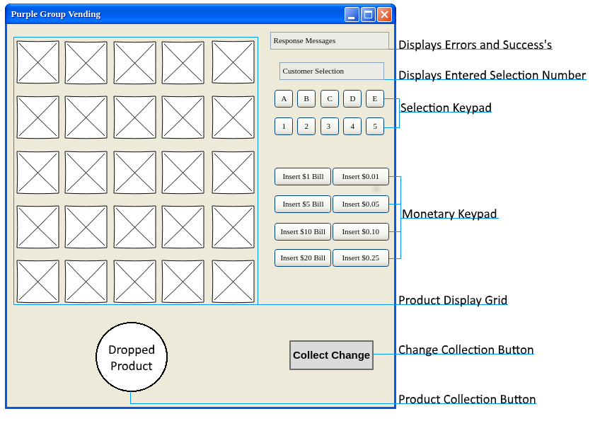
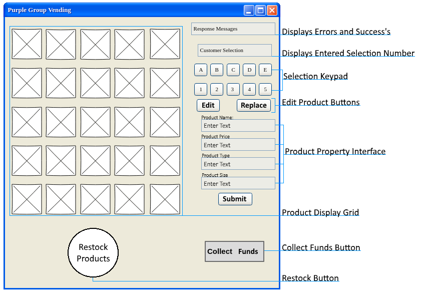
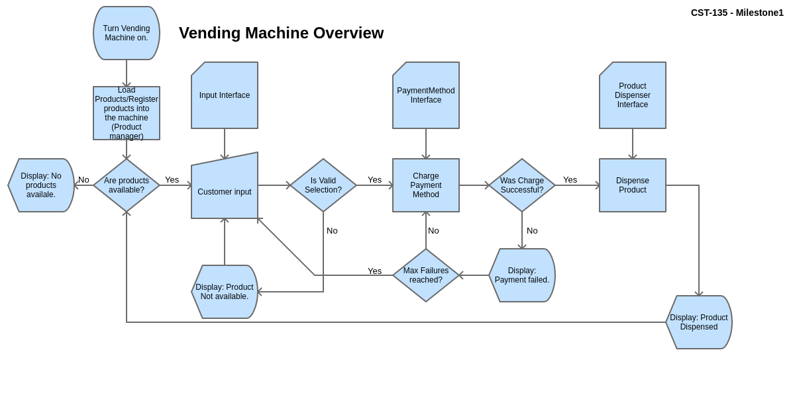
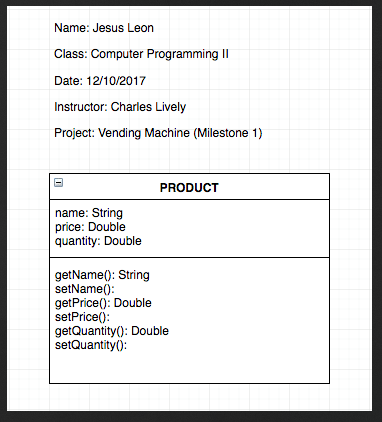
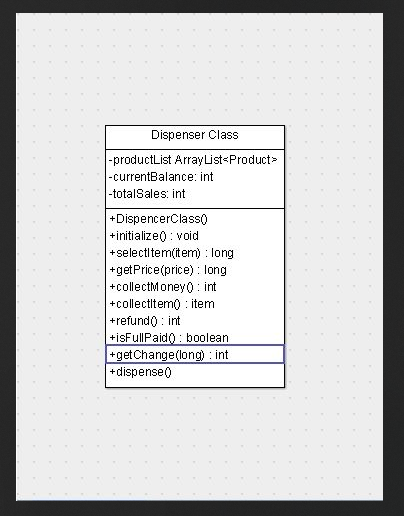

##### Purple Group
##### CST-135
##### 12/10/2017
##### Charles Lively

# Milestone 1 Activity Vending Machine Project
### Credits

- Storyboard – James Ray
- Product Class UML – Jesus Leon
- Dispenser Class UML -Robert Wade
- Read Me – Christopher Hyde

### Project Objectives
Customers will be able to insert money into the machine and select a product from a predetermine list of products by button pushes. A boss will be able to restock, edit products, and collect money from a separate interaction window that will be available from in the customer window.

### Customer Instructions:

- **Selecting a product\*** - Select a product pushing the selection keys of the product number and pushing enter. The keys you have pressed will display above the selection keypad. Please double check selection entered before pressing enter.
- **Paying for you product\*** – To pay just select a monetary button representing the amount equal to or above the cost of the product.
- **Collecting Product** – Once selected and purchased your product will appear in the lower _Dispenser Slot_. Click the product in the _Dispenser Slot_ to collect.
- **Don't forget your change –** Any left-over funds from your purchases can be collected by pressing the change button.

\* The product numbers and prices are located above the products displayed icon.

### Customer GUI Overview

### Customer Interactions:
- **Selection Keypad** - Button to enter the letter and number of the product to purchase.
- **Monetary Keypad** - Buttons that allow the user to input a selected amount of currency.
- **Change Collection Button** – Button that returns the change after product purchase to customer.
- **Product Collection Button** – Button that allows the user to collect their product.

### Boss Instructions:
- **Restock Products** - Press the restock button to replenish all products stocks
- **Collect Money** - Press To collect funds button to collect the funds you earned.
- **Edit Product** -  Use the selection keypad to choose a product then press the edit button. Edit any text property and click submit to finalize edits.
- **Replace Product** - Use the selection keypad to choose a product to replace then press the replace button. Fill in the new products details and click submit.

### Boss GUI Overview

### Boss Interaction:

- **Selection Keypad** - Button to enter the letter and number of the product to edited or replaced.
- **Restock Button** - Button that runs a method that restocks all products.
- **Collect Money Button** - Button that allows the boss to add the earned money to their account.
- **Edit Product Button** - Button that will run the edit product property interface.
- **Replace Product Button** - Button will run the replace product property interface.
- **Submit Button** - Submits changes made in the product property interface.

### Customer Flowchart
Provided by James Ray

### Product UML
Provided by Jesus Leon

### Dispenser UML
Provided by Rob Wade
